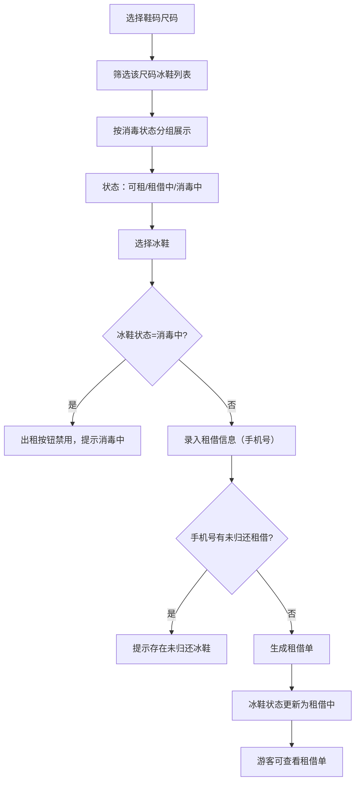

## 1. 产品概述

冰场租鞋尺码看板是一款面向冰场运营的纯前端管理系统，通过浏览器本地存储实现冰鞋库存管理、租借流程跟踪和消毒状态监控，无需对接真实后端服务。

- 主要用途：冰场前台维护冰鞋尺码库存，监控消毒状态，处理游客租借申请；游客查看个人租借单
- 目标用户：冰场前台管理员、租借冰鞋的游客
- 核心价值：实现冰鞋全生命周期可视化管理，确保消毒流程合规，防止重复租借风险

## 2. 核心功能

### 2.1 用户角色

| 角色 | 登录方式 | 核心权限 |
|------|----------|----------|
| 前台管理员 | 角色切换 | 维护冰鞋库存、管理尺码、更新消毒状态、处理租借申请、归还冰鞋 |
| 游客 | 手机号查询 | 查看个人租借单、查询冰鞋可租状态、提交租借申请 |

### 2.2 功能模块

1. **尺码看板首页**：冰鞋尺码库存总览、消毒状态实时展示、可租数量统计
2. **库存管理**：冰鞋档案维护、尺码增删改、状态流转管理
3. **租借管理**：租借申请、归还处理、租借记录查询
4. **消毒管理**：消毒状态标记、消毒流程跟踪、消毒中冰鞋拦截

### 2.3 页面详情

| 页面名称 | 模块名称 | 功能描述 |
|-----------|-------------|---------------------|
| 尺码看板首页 | 尺码筛选区 | 按鞋码范围筛选，快速定位目标尺码冰鞋 |
| 尺码看板首页 | 消毒状态看板 | 可视化展示各尺码冰鞋的消毒状态分布（可租/租借中/消毒中） |
| 尺码看板首页 | 库存统计卡片 | 展示总库存、可租数、租借中、消毒中数量统计 |
| 库存管理页 | 冰鞋档案列表 | 冰鞋编号、尺码、状态、入库时间等信息维护 |
| 库存管理页 | 状态操作区 | 标记消毒中、标记可租、报废删除等操作 |
| 租借管理页 | 租借申请表单 | 手机号、姓名、选择冰鞋、租借时间录入 |
| 租借管理页 | 租借单列表 | 按手机号查询，展示租借状态、租借时间、应还时间 |
| 租借管理页 | 归还操作区 | 冰鞋归还、自动流转到消毒中状态 |

## 3. 核心流程

### 3.1 主流程：尺码筛选到消毒状态看板

游客或管理员选择目标尺码 → 系统筛选展示该尺码所有冰鞋 → 按消毒状态分组展示（可租/租借中/消毒中）→ 选择可租冰鞋提交租借 → 系统校验业务规则 → 校验通过生成租借单，冰鞋状态更新为"租借中"

### 3.2 Mermaid 流程图

### 3.3 归还流程

游客归还冰鞋 → 管理员确认归还 → 冰鞋状态自动更新为"消毒中" → 消毒完成后管理员标记"可租"

## 4. 用户界面设计

### 4.1 设计风格

**设计基调：冷调冰雪主题 + 现代工业风**

- **主色调**：冰蓝 `#0EA5E9`（代表冰场）、深靛蓝 `#1E3A5F`（代表专业稳重）
- **辅助色**：消毒警示橙 `#F97316`（消毒中）、成功绿 `#10B981`（可租）、租借紫 `#8B5CF6`（租借中）
- **中性色**：冷灰系列 `#F8FAFC`、`#E2E8F0`、`#64748B`、`#1E293B`
- **按钮风格**：圆角 8px，微立体阴影，悬停上浮效果，禁用状态灰色半透明
- **字体**：标题使用 Inter SemiBold，正文使用 Inter Regular，数字使用等宽字体增强数据感
- **布局风格**：卡片式布局，网格对齐，状态色标签系统，数据看板使用柱状可视化
- **图标风格**：线性 lucide 图标，配合状态色使用

### 4.2 页面设计概览

| 页面名称 | 模块名称 | UI 元素 |
|-----------|-------------|-------------|
| 尺码看板首页 | 顶部统计区 | 四张数据卡片带渐变背景，数字放大显示，状态色边框 |
| 尺码看板首页 | 尺码筛选条 | 横向滚动尺码标签，选中高亮冰蓝色，圆角胶囊造型 |
| 尺码看板首页 | 状态看板网格 | 卡片网格布局，每张卡片显示冰鞋编号、状态标签、操作按钮 |
| 尺码看板首页 | 状态图例 | 可租（绿点）、租借中（紫点）、消毒中（橙点脉动动画） |
| 库存管理页 | 冰鞋列表 | 表格布局，支持排序筛选，行内操作按钮 |
| 租借管理页 | 租借表单 | 分组表单，手机号验证，冰鞋选择器带状态指示 |
| 租借管理页 | 租借单卡片 | 时间线展示租借进度，状态徽章醒目 |

### 4.3 交互动效

- 消毒中状态标签：橙色脉冲呼吸动画 `animate-pulse`
- 卡片悬停：上浮 2px + 阴影加深
- 按钮点击：缩放 0.98 反馈
- 状态变更：渐变过渡动画 0.3s
- 页面加载：骨架屏脉冲效果

### 4.4 响应式

- **桌面优先**：1280px 以上最优展示，网格布局 4 列
- **平板适配**：768px-1279px，网格 2 列
- **手机适配**：768px 以下，单列布局，尺码筛选改为下拉选择
- 触摸优化：按钮最小高度 44px，点击区域放大

## 5. 业务规则校验

### 5.1 消毒中冰鞋拦截

- 消毒中状态的冰鞋在列表中"出租"按钮强制禁用
- 禁用按钮显示 tooltip："此冰鞋正在消毒中，暂不可出租"
- 消毒中冰鞋卡片添加橙色边框和脉动警示效果

### 5.2 手机号重复租借拦截

- 提交租借申请时，校验该手机号是否存在"租借中"状态的订单
- 如存在未归还订单，弹出提示："该手机号尚有未归还的冰鞋，请先归还后再租借"
- 阻止租借单生成

### 5.3 本地数据持久化

- 所有数据（冰鞋库存、租借单、状态变更记录）存储于浏览器 LocalStorage
- 页面刷新后自动从 LocalStorage 恢复数据
- 提供"重置演示数据"功能恢复初始状态
