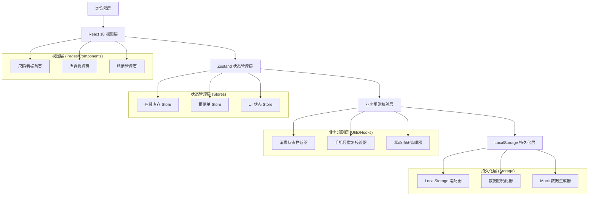
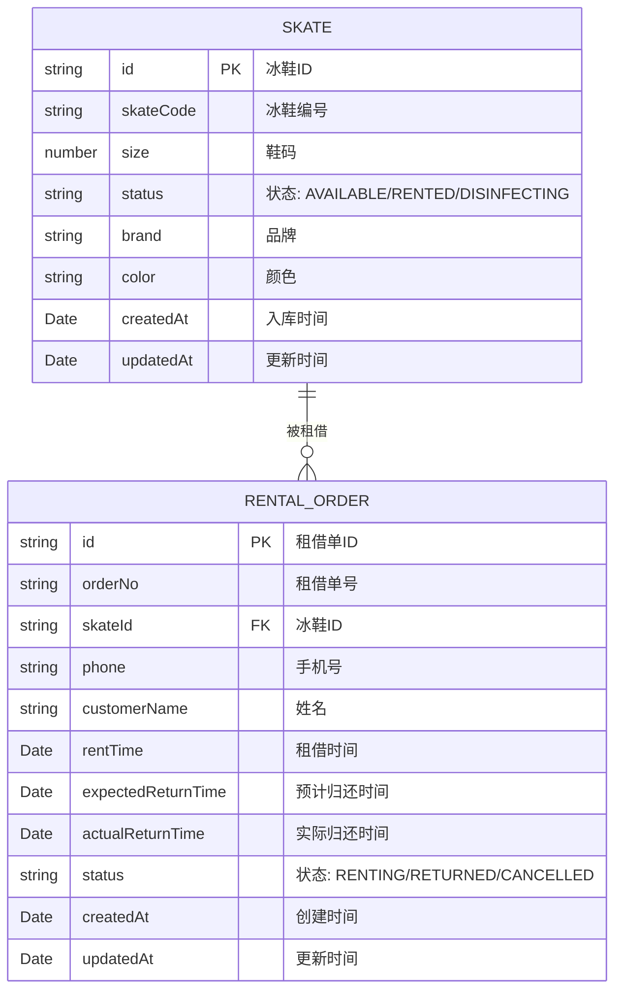

## 1. 架构设计



## 2. 技术描述

- **前端框架**: React@18 + TypeScript
- **构建工具**: Vite@5
- **样式方案**: TailwindCSS@3
- **状态管理**: Zustand@4
- **路由管理**: react-router-dom@6
- **图标库**: lucide-react
- **数据持久化**: 浏览器 LocalStorage（无真实后端）
- **容器化**: Docker + Nginx
- **包管理器**: npm（macOS 环境）

## 3. 目录结构

```
src/
├── components/          # 可复用组件
│   ├── layout/         # 布局组件
│   ├── ui/             # 基础 UI 组件
│   └── features/       # 业务组件
├── pages/              # 页面组件
│   ├── Dashboard.tsx   # 尺码看板首页
│   ├── Inventory.tsx   # 库存管理页
│   └── Rental.tsx      # 租借管理页
├── stores/             # Zustand 状态管理
│   ├── useSkateStore.ts
│   ├── useRentalStore.ts
│   └── useUiStore.ts
├── hooks/              # 自定义 Hooks
│   ├── useLocalStorage.ts
│   ├── useValidation.ts
│   └── useStatusFlow.ts
├── utils/              # 工具函数
│   ├── storage.ts
│   ├── validator.ts
│   ├── constants.ts
│   └── mockData.ts
├── types/              # TypeScript 类型定义
│   └── index.ts
├── App.tsx
├── main.tsx
└── index.css
```

## 4. 路由定义

| 路由路径 | 页面名称 | 功能说明 |
|----------|----------|----------|
| `/` | 尺码看板首页 | 尺码筛选、消毒状态看板、库存统计 |
| `/inventory` | 库存管理页 | 冰鞋档案维护、状态流转管理 |
| `/rental` | 租借管理页 | 租借申请、归还处理、租借单查询 |

## 5. 数据模型

### 5.1 数据模型 ER 图



### 5.2 类型定义

```typescript
// 冰鞋状态枚举
export enum SkateStatus {
  AVAILABLE = 'AVAILABLE',     // 可租
  RENTED = 'RENTED',           // 租借中
  DISINFECTING = 'DISINFECTING' // 消毒中
}

// 租借单状态枚举
export enum RentalStatus {
  RENTING = 'RENTING',   // 租借中
  RETURNED = 'RETURNED', // 已归还
  CANCELLED = 'CANCELLED' // 已取消
}

// 冰鞋实体
export interface Skate {
  id: string;
  skateCode: string;
  size: number;
  status: SkateStatus;
  brand: string;
  color: string;
  createdAt: string;
  updatedAt: string;
}

// 租借单实体
export interface RentalOrder {
  id: string;
  orderNo: string;
  skateId: string;
  phone: string;
  customerName: string;
  rentTime: string;
  expectedReturnTime: string;
  actualReturnTime?: string;
  status: RentalStatus;
  createdAt: string;
  updatedAt: string;
}

// 库存统计
export interface InventoryStats {
  total: number;
  available: number;
  rented: number;
  disinfecting: number;
}

// 按尺码分组的统计
export interface SizeStats {
  size: number;
  total: number;
  available: number;
  rented: number;
  disinfecting: number;
}
```

### 5.3 LocalStorage 存储键

| 存储键名 | 数据类型 | 说明 |
|----------|----------|------|
| `icerink_skates` | `Skate[]` | 冰鞋库存数据 |
| `icerink_rentals` | `RentalOrder[]` | 租借单数据 |
| `icerink_initialized` | `boolean` | 数据初始化标记 |

## 6. 业务规则实现

### 6.1 消毒中冰鞋拦截

```typescript
// src/utils/validator.ts
export function canRentSkate(skate: Skate): { valid: boolean; message?: string } {
  if (skate.status === SkateStatus.DISINFECTING) {
    return {
      valid: false,
      message: '此冰鞋正在消毒中，暂不可出租'
    };
  }
  if (skate.status === SkateStatus.RENTED) {
    return {
      valid: false,
      message: '此冰鞋已被租借'
    };
  }
  return { valid: true };
}
```

### 6.2 手机号重复租借校验

```typescript
// src/utils/validator.ts
export function canPhoneRent(
  phone: string,
  rentalOrders: RentalOrder[]
): { valid: boolean; message?: string } {
  const hasUnreturned = rentalOrders.some(
    order => order.phone === phone && order.status === RentalStatus.RENTING
  );
  if (hasUnreturned) {
    return {
      valid: false,
      message: '该手机号尚有未归还的冰鞋，请先归还后再租借'
    };
  }
  return { valid: true };
}
```

### 6.3 冰鞋状态流转

```
AVAILABLE (可租)
    ↓ 租借
RENTED (租借中)
    ↓ 归还
DISINFECTING (消毒中)
    ↓ 消毒完成
AVAILABLE (可租)
```

## 7. Docker 容器配置

- 基础镜像: `nginx:alpine`
- 构建阶段: `node:18-alpine` 进行前端构建
- 端口映射: 宿主 8380 → 容器 80
- 数据持久化: 浏览器 LocalStorage，无需容器数据卷

## 8. 验收脚本说明

验收命令将通过 curl 或浏览器自动化测试验证：
1. 消毒中冰鞋的出租按钮状态（disabled）
2. 同一手机号重复租借的拦截提示
3. 页面刷新后数据持久化验证
